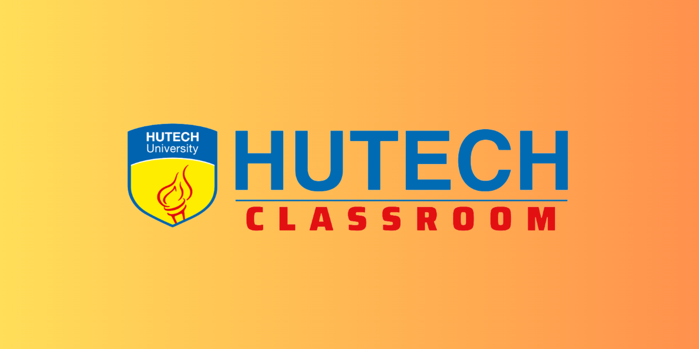

<div align="center">
	<picture>
		
	</picture>
</div>

<hr>

# Hutech Classroom Client App

Welcome to the Hutech Classroom Client App repository! This is a React-based application that serves as the **frontend** for the Hutech Classroom platform. It utilizes MobX for state management and MUI (Material-UI) for UI components.

## ✨ Table of Contents
- [Overview](#overview)
- [Getting Started](#getting-started)
- [Features](#features)
- [Built with](#built-with)
- [Web API](#web-api)
- [Web Administration](#web-administration)
- [User Web Interface](#user-web-interface)
- [Source Code](#source-code)
- [Contributing](#contributing)
- [License](#license)

## 🎓 Overview
<p align="justify">
	The HUTECH CLASSROOM project is a Classroom Management System designed for HUTECH University. Its purpose is to improve the management of classrooms, create favorable conditions for students, and support teachers and the university in monitoring and managing information.
</p>

<blockquote>
	<p align="justify">
		This is a product developed for the specialized projects at HUTECH University. The aim of this project is to assist teachers or staff members at the university in a more efficient classroom management process for students. This project is not intended for commercial purposes.
	</p>
	<p align="justify">
		We are a group of students at HUTECH University. This project is a part of our learning process, and we hope it can be of benefit to HUTECH University in particular, and other universities in general.
	</p>
</blockquote>

<p align="justify">
	If you are interested or have suggestions for this project, please contact the contributors on this project!
</p>

## 🚀 Getting Started
To get started with the Hutech Classroom Client App, follow the installation instructions outlined below:

1. Clone this repository:
```bash
git clone https://github.com/MeiCloudie/hutech-classroom-client-app.git
```

2. Navigate to the project directory:
```bash
cd hutech-classroom-client-app
```

3. Install dependencies:
```bash
npm install
```

4. Set up environment variables:
- Create a `.env` file at the root of the project
- Provide the required environment variables (refer to `.env.example`)

5. Start the development server:
```bash
npm start
```

6. Access the app at `http://localhost:3000`

## 📚 Features
1. **User Authentication and Role-Based Access Control:**
   - Secure login for students, staff, course coordinators, department heads, educational staff, and administrators.
   - Role-based access control to ensure users only access relevant features and data.

2. **Student and Staff Information Management:**
   - Input and management of student and staff information, including basic details and roles.

3. **Department and Major Management:**
   - Creation and management of department and major information.

4. **Course Management:**
   - Input and management of course details, credit hours, contact hours, knowledge volume, and more.

5. **Class Management:**
   - Organizing classes by semester, generating class codes, and managing class details.

6. **Assignment, Project, and Task Management:**
   - Creation and management of assignments, projects (including group projects), and tasks.
   - Submission of solutions by students with support for multiple versions.

7. **Discussion Forum:**
   - A platform for students to create posts, comment, and engage in academic discussions.

8. **Messaging:**
   - Direct messaging feature for private communication and collaboration among students.

9. **Web and Mobile Accessibility:**
   - Accessible via both website and mobile app for flexibility.

10. **User-Friendly Interfaces:**
    - User-friendly interfaces with intuitive navigation for an enhanced user experience.

11. **Data Management:**
    - Efficient organization and access to class information, assignments, projects, tasks, and user data.

12. **Notifications:**
    - Notification system to alert users about important updates, deadlines, and messages.

13. **Data Privacy and Security:**
    - Prioritizing data privacy and security to protect user and academic data.

14. **Scalability:**
    - Design to accommodate future growth in users, courses, and data volume.

15. **Maintenance and Support:**
    - Provisions for ongoing system maintenance and user support.

16. **Documentation and Training:**
    - Comprehensive documentation and training materials for users and administrators.

17. **Feedback Mechanism:**
    - Mechanism for users to provide feedback, report issues, and suggest improvements.

18. **Compliance:**
    - Compliance with relevant laws and regulations related to data privacy, accessibility, and educational standards.

19. **Integration:**
    - Support for integration with other university systems and tools.

20. **Reporting and Analytics:**
    - Reporting and analytics capabilities to generate insights into student performance and system usage.

21. **Backup and Recovery:**
    - Regular data backups and recovery plan to prevent data loss and downtime.

22. **User Support:**
    - Channels for user support to address questions, issues, and technical difficulties.

23. **Usability Testing:**
    - Conducting usability testing with students and staff to ensure user-friendliness.

24. **Continuous Improvement:**
    - Establishing a process for continuous system improvement based on user feedback.

25. **Scalable Architecture and Interoperability:**
    - Scalable system architecture and interoperability with other university systems.

26. **Security Measures:**
    - Robust security measures, including data encryption and access controls.

27. **Accessibility:**
    - Ensuring the system is accessible to users with disabilities.

And a few other functions for this project are in development!

## ✅ Built with
The Hutech Classroom Client App is built with the following technologies:
- [React](https://reactjs.org/) - A JavaScript library for building user interfaces
- [MobX](https://mobx.js.org/) - A state management library for React applications
- [MUI (Material-UI)](https://mui.com/) - A popular React UI framework based on Material Design principles

## 🔵 Web API

The Web API serves as the **backend** for the HUTECH Classroom system. It handles various requests and provides the necessary functionalities. You can explore the Web API by visiting the following URL: [Web API](https://hutechclassroom.azurewebsites.net/swagger/index.html)

⚠ You can watch it because this project is still a work in progress, not yet in use!

## 🔴 Web Administration

The Web Administration is the administrative web interface for the HUTECH Classroom system. It allows administrators to manage classrooms, users, and perform other administrative tasks. You can access the Web Administration interface at: [Web Administration](https://hutechclassroomweb.azurewebsites.net/)

⚠ You can watch it because this project is still a work in progress, not yet in use!

## 🟢 User Web Interface

The User Web Interface is the user-facing web interface for the HUTECH Classroom system. It enables users to access classrooms, interact with course materials, submit assignments, and engage in online discussions. You can access the User Web Interface at: [User Web Interface](https://hutech-classroom-edu.vercel.app/)

▶ In the future we will develop on mobile!

## 💬 Source Code

The source code for the HUTECH Classroom project is publicly available on GitHub.

⚠ You can watch it because this project is still a work in progress, not yet in use!

### Backend Source Code

The backend source code repository can be found at: [Backend Source Code](https://github.com/Slimaeus/HUTECHClassroom)

### Frontend Source Code

The frontend source code repository can be found at: [Frontend Source Code](https://github.com/MeiCloudie/hutech-classroom-client-app)

Please contact us if you would like to contribute to this project!

## 💌 Contributing
Contributions to the Hutech Classroom Client App are welcome! If you find any bugs, issues, or have suggestions for improvements, please open an issue on the GitHub repository.

- Fork this repository.
- Create your new branch with your feature: `git checkout -b my-feature`.
- Commit your changes: `git commit -am 'feat: My new feature'`.
- Push to the branch: `git push origin my-feature`.
- Submit a pull request 👌.

## 🏆 Contributors

We are students at HUTECH university:

<table>
	<tr>
		<td align="center" valign="top">
				
        <br>
        <a href="https://github.com/Slimaeus">Nguyen Hong Thai</a>
		</td>
		<td align="center" valign="top">
				
        <br>
        <a href="https://github.com/MeiCloudie">Truong Thuc Van</a>
		</td>
	</tr>
</table>

## 🔒 License
The Hutech Classroom Client App is open source and is licensed under the [MIT License](LICENSE).

